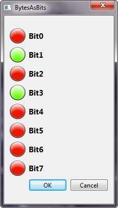
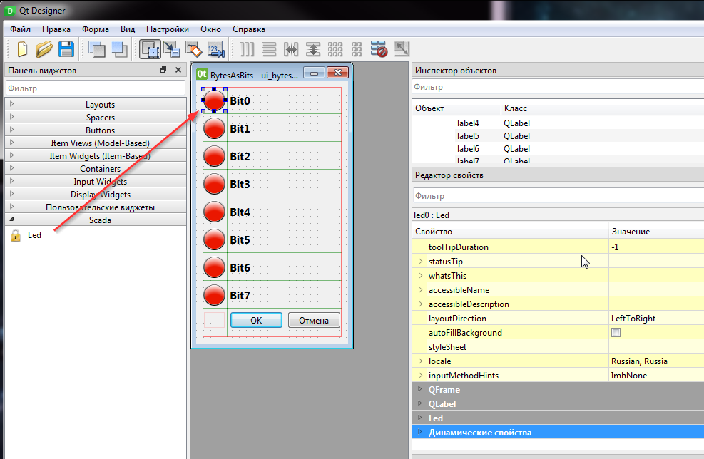

# PyDesignerPlagin
# Custom widget for Designer (PySide6)

## How to use
note: We will work with **env_root** enviroment
#### Prepearing
+ Installing PySide6, cx_Freeze
~~~bash
$ source env_root/Script/activate
(env_root)$ pip install PySide6 cx_Freeze
(env_root)$ deactivate
~~~
+ create folder for designer's plugins **C:\PyQtPlugins\PySide6Designer**
+ create environment variable: **PYSIDE_DESIGNER_PLUGINS** = **C:\PyQtPlugins\PySide6Designer**

#### Development
1. Copy plugins (from **plugins** in to **${PYSIDE_DESIGNER_PLUGINS}** folder)
2. Copy **led.py** widget from **plugin\** folder to root folder (when all *.py files located)
3. Execute designer (**you need pyside6-designer!!!**)
~~~bash
$ source env_root/Script/activate
(env_root)$ env_root/Scripts/pyside6-designer.exe (maybe you need switch to env_root)
~~~

2. Save as **ui_byteasbits.ui**
3. Convert ***.ui** file to ***.py** file
~~~bash
$ source env_root/Script/activate
(env_root)$ pyside6-uic.exe ui_bytesasbits.ui -o ui_bytesasbits.py
~~~

## How to build application
~~~bash
$ source env_root/Script/activate
(env_root)$ python setup.py bdist_msi
(env_root)$ python setup.py build
(env_root)$ deactivate
~~~
